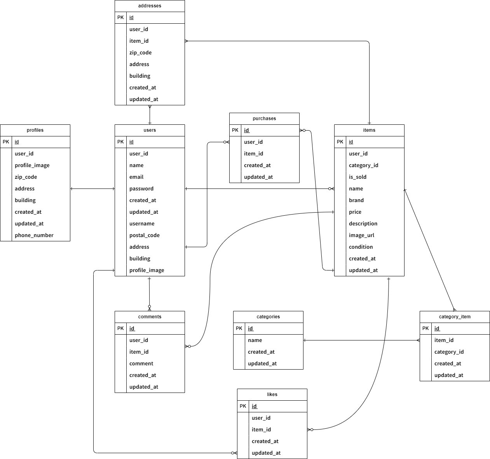

# coachtech-fleamarket

## Dockerビルド
- `$ git clone git@github.com:asamiwatababe/coachtech-fleamarket.git`
- `$ docker-compose up -d --build`

## Laravel環境構築(すべての artisan コマンドや composer install は PHPコンテナ内で実行してください。)
- `$ docker-compose exec php bash`
- `$ composer install`
- `$ cp .env.example .env`環境変数を適宜変更
# ※ 必要に応じて .env ファイルの内容（DB接続など）を自分の環境に合わせて修正してください
- `$ php artisan key:generate`
- `$ php artisan migrate --seed`

## 開発環境
- トップ画面：[http://localhost/]
- ユーザー登録：[http://localhost/register]
- ログイン画面：[http://localhost/login]

## 使用技術（実行環境）
- Laravel 8.75
- PHP 7.4.9
- MySQL 8.0.26
- Docker / Docker Compose
- GitHub
- phpMyAdmin（http://localhost:8080）

## ER図

## URL
- 開発環境：http://localhost/
